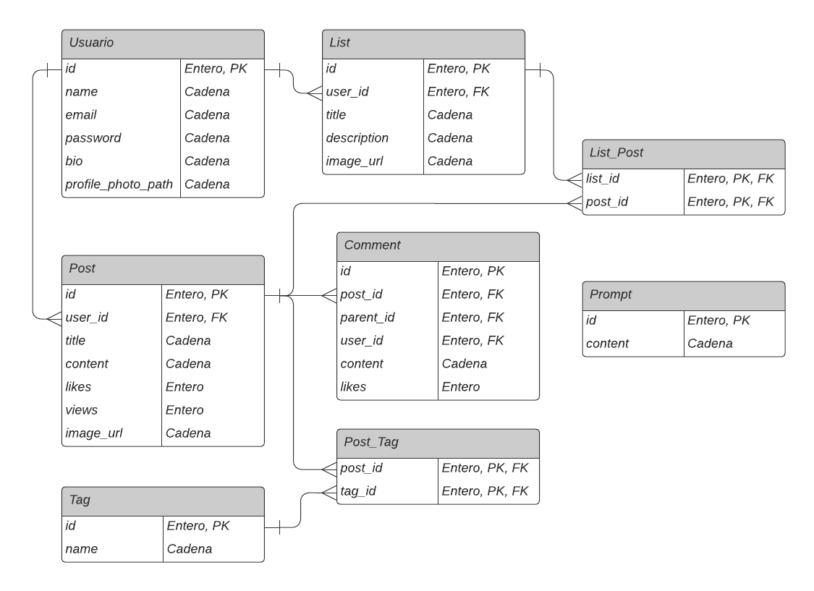

# Echo

Un sitio web para publicar tus ideas al mundo, uniendo a lectores y creadores de contenido en un solo lugar.

## Instalación

1. Instalar dependencias:

    ```npm install```

2. Generar un build:

    ```npm run build```

3. Ejecutar las migraciones:

    ```php artisan migrate```

## Proyecto

Echo surge como respuesta a plataformas de blog que no ofrecen una experiencia de usuario satisfactoria, tanto para lectores como para creadores de contenido. La idea es crear un sitio web que permita a los usuarios publicar sus ideas al mundo, uniendo a lectores y escritores en un solo lugar.

## Tecnologías

Se trata de una aplicación full-stack desarrollada con Laravel y Vue.js. El backend está desarrollado con Laravel, mientras que el frontend está desarrollado con Vue.js y TailwindCSS, usando Inertia.js como puente entre ambos.

## Características

Un usuario puede crear una cuenta y publicar sus ideas en forma de artículos, y pueden ser editados o eliminados por el usuario que los creó. Los usuarios pueden seguir a otros usuarios, y ver los artículos que estos publican en su feed de noticias. Los usuarios pueden darle like a los artículos que les gusten, y agregarlos a sus propias listas personalizadas.

Un usuario autenticado puede también comentar los artículos que le gusten, y responder a los comentarios de otros usuarios. Los usuarios pueden editar o eliminar sus propios comentarios, pero no los de otros usuarios.

Los usuarios pueden crear listas personalizadas, y agregar artículos a estas listas. Los artículos pueden ser agregados a múltiples listas, y los usuarios pueden agregar o quitar artículos de sus listas en cualquier momento.

Los usuarios pueden realizar búsquedas por artículos, usuarios, etiquetas o listas, y filtrar los resultados por categoría.

### Diagrama ER



### Licencia

El presente proyecto se encuentra bajo la licencia MIT. Para más información, ver el archivo [LICENSE](LICENSE).
